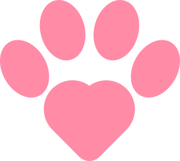

  

 
  A platform to connect people to adopt pets, with available profiles.

  <a href="#🎯-objective">Objective</a>&nbsp;&nbsp;&nbsp;|&nbsp;&nbsp;&nbsp;
  <a href="#⚛️-techs">Techs</a>&nbsp;&nbsp;&nbsp;|&nbsp;&nbsp;&nbsp;
  <a href="#📝-license">License</a>

  

## 🎯 Objective

Build an application to adopt and donate pets with authentication.

## ⚛️ Techs

- [Java](https://www.java.com/pt-BR/)
- [Spring](https://spring.io/)
- [React](https://react.dev/)
- [Vite](https://vite.dev/)

## 📝 License

This project was developed using the MIT license. See more about [LICENSE](LICENSE) for more information.

---

Made with 💟 by [Rodrigo Gouveia.](https://github.com/rodrigoge)
